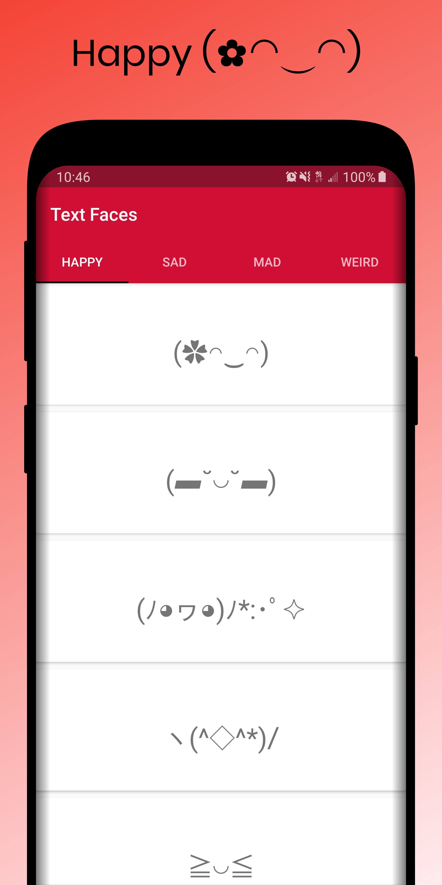

# Keyboard-Text-Faces
Copy and paste various text faces

  
   
  
  

# Installation
You can download it from the release [right here.](https://github.com/That1guy17/Keyboard-Text-Faces/releases/tag/v1.0)
